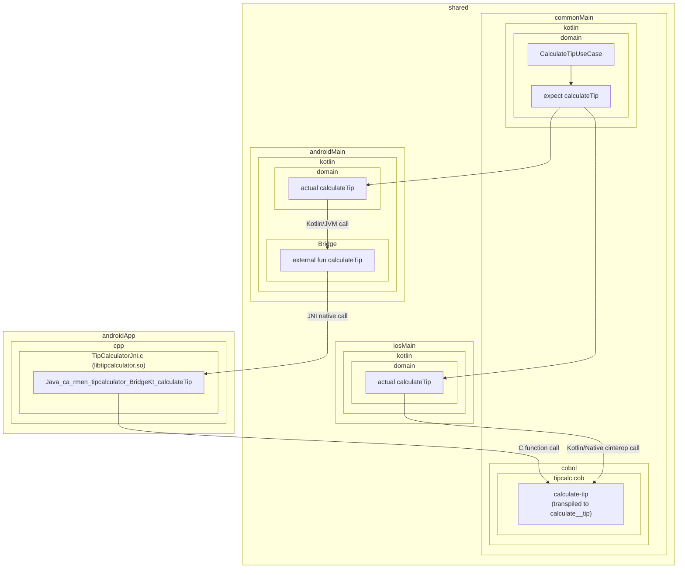

# Architecture

Call flow for the call to the cobol `calculate-tip` procedure, starting from the kotlin use case.

```mermaid
graph TD
    subgraph androidApp
        subgraph cpp
            subgraph TipCalculatorJni["TipCalculatorJni.c<br>(libtipcalculator.so)"]
                calculateTipJni["Java_ca_rmen_tipcalculator_BridgeKt_calculateTip"]
            end
        end
    end
    subgraph shared
        subgraph commonMainlib[commonMain]
            subgraph cobol
                subgraph tipcalc["tipcalc.cob"]
                    cobcalculatetip["calculate-tip<br>(transpiled to calculate__tip)"]
                end
            end
            subgraph kotlin
                subgraph domain
                    CalculateTipUseCase
                    calculateTip["expect calculateTip"]
                end
            end
        end
        subgraph androidMain
            subgraph androidkotlin["kotlin"]
                subgraph androiddomain["domain"]
                    calculateTipAndroid["actual calculateTip"]
                end
                subgraph androidbridge["Bridge"]
                    calculateTipBridge["external fun calculateTip"]
                end
            end
        end
        subgraph iosMain
            subgraph ioskotlin["kotlin"]
                subgraph iosdomain["domain"]
                    calculateTipiOS["actual calculateTip"]
                end
            end
        end
  end

  CalculateTipUseCase --> calculateTip
  calculateTip --> calculateTipAndroid
  calculateTip --> calculateTipiOS
  calculateTipAndroid --> |"Kotlin/JVM call"|calculateTipBridge
  calculateTipBridge --> |"JNI native call"|calculateTipJni
  calculateTipJni --> |"C function call"|cobcalculatetip
  calculateTipiOS --> |"Kotlin/Native cinterop call"|cobcalculatetip
```