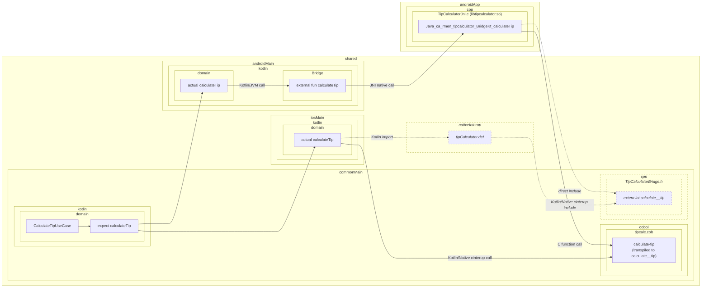

# Architecture

Call flow for the call to the cobol `calculate-tip` procedure, starting from the kotlin use case.

Solid lines indicate runtime flow.

Dashed lines and italics indicate compile-time symbol resolution.
